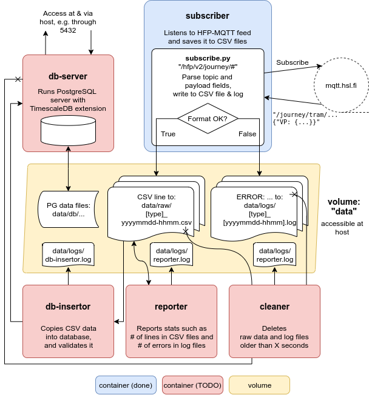

# Record public transit high-frequency positioning data

See [Digitransit HFP documentation](https://digitransit.fi/en/developers/apis/4-realtime-api/vehicle-positions/).

This is a tool for recording HFP v2 feed for later use.

## Usage

**TODO:** Docker compose, common volume, using individual services

## Architecture

**[subscriber](subscriber)** saves the data stream to csv files and logs possible errors,
for a given amount of seconds.
Run this e.g. every 15 minutes.

**TODO: db-server** is a PostgreSQL database with [TimescaleDB](https://docs.timescale.com/latest/main) extension for storing certain aspects of the HFP data, such as vehicle position events, or traffic light priority events.
It automatically deletes data older than given period of time (Timescale)
Start this once, and keep available!

**TODO: db-insertor** copies the results of **subscriber** to **db-server** and drops erroneous records such as duplicate rows.
Run this e.g. once a day, or whenever a csv file is ready, depending on how you want to distribute the load of your host server.

**TODO: cleaner** deletes csv files, logs and database records older than a given period of time.
Run this e.g. once a day.

**TODO: reporter** sends diagnostic statistics of the above services to a Slack channel.
Run this e.g. once a day.
