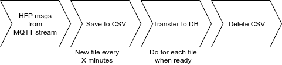

# Record public transit high-frequency positioning data

See [Digitransit HFP documentation](https://digitransit.fi/en/developers/apis/4-realtime-api/vehicle-positions/).

This repository contains

- **TODO:** routines for subscribing to HFP feed by [HSL](https://hsl.fi)
- **TODO:** routines for managing and deleting old record files and logs
- **TODO:** infrastructure for a database that stores the recorded HFP data.

## Usage

**TODO**

## Architecture

A subscription script cleans up and saves the data stream to csv files.
The resulting files can be compressed and stored for later use,
or their contents can be transferred into a Postgres-Timescale database.
